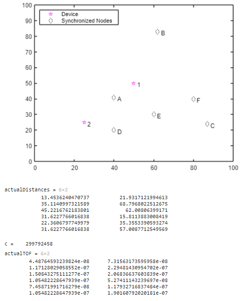
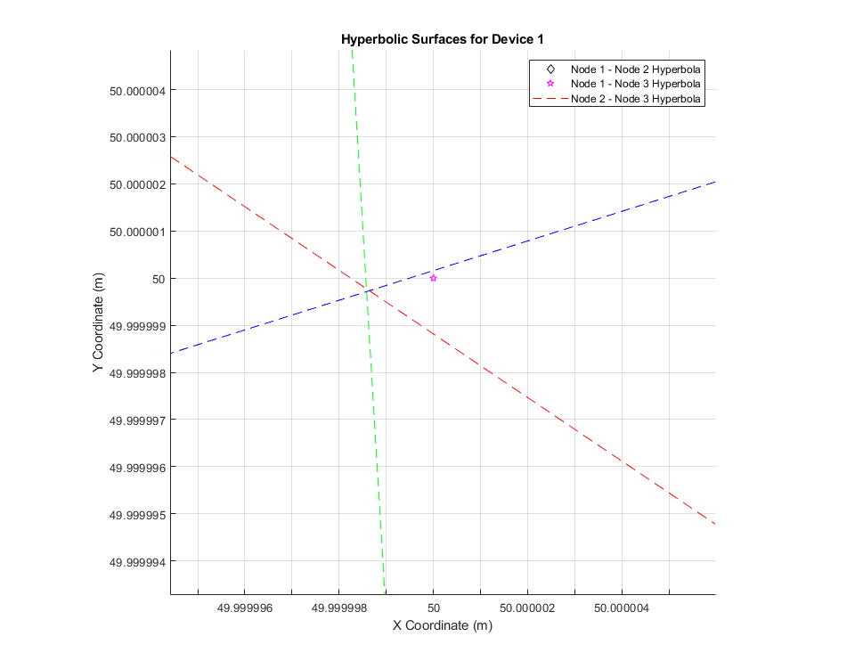

# UWB-Algorithms-on-MATLAB
Master 1 Internship at Sapienza University in Ultra wideband in the DIET department.

# Table of Contents
1. [UWB 802.15.4 toolbox Matlab](#1-uwb-802154-toolbox-matlab)
     - [One Way Ranging / Time Difference On Arrival](#1--one-way-ranging--time-difference-on-arrival)
   
2. [Post Processing with reel CIR values]()
3. [Theoretical UWB Channel and CIR](#3--Theoretical-UWB-Channel-and-CIR)
4. [Data set Creation]()
5. [References](#2-References)

# 1. UWB 802.15.4 toolbox Matlab
Pretty big prog which does a lot of things !
I tried to synthetise all prog that matlab gives and more !
So, i will try to detail it !
### 1.  One Way Ranging / Time Difference On Arrival
This first part is based on the [UWB Localization Using IEEE 802.15.4z](https://fr.mathworks.com/help/comm/ug/uwb-localization-using-ieee-802.15.4z.html) program gives by matlab.
- Firstly, you put in input **an infinte number of anchors and tags**. It will calculates the distance and the time of flight between the initiators and the receptors based on the coordonates.

- Then you will put your data file for configure the MAC and PHY layers
- Based on your data and your config it will calculates for each blincks, iniators and receptors pairs : **the distance**, **the time of flight** and mostly **the Time Difference On Arrival (TDOA)**. It takes in account the noise and preamble (but you need to configure it).

- After that, you will be able to see the TDOA based on hyperbolics intersection of pairs of nodes **for each initiators (devices)**. It takes 3 pairs of nodes (receptors) based on 3 nodes that you can choose and modify
  
- Finaly, the program will caculates **the distance errors** difference between the device position and the hyperbolics intersection because as you see the intersection doesn't cross the initiator.

# 2. Post Processing with reel CIR values
The goal here is to be able to analyse the channel impulsive response. As there are several ways of processing the data, several more or less complex versions, there are several versions of the programme.
However, they all have a common structure, which I will describe in detail below. 

# 3. Theoretical UWB Channel and CIR

# 3. References
## Papers
Some papers interesting and not it depends on what you search.
- [Detection of the LOS/NLOS state change based on the CIR features](doc/Detection_of_the_LOS_NLOS_state_change_based_on_the_CIR_features.pdf)
- [NOISE: Radio Channel Impulse Response Measurement and Analysis](doc/Radio_Channel_Impulse_Response_Measurement_and_Analysis.pdf)
- [Impulsive noise in UWB systems and its suppression](doc/Impulsive_noise_in_UWB_systems_and_its_suppression)
- [UWB Channel Impulse Responses for Positioning in complex environments](doc/UWB_Channel_Impulse_Responses_for_Positioning_in_complex_environments)
## DWM1000
- [Application Note APS006 Part 1](doc/Application_Note_APS006_Part_1.pdf)
- [Application Note APS006 Part 2](doc/Application_Note_APS006_Part_2.pdf)
- [Application Note APS006 Part 3](doc/Application_Note_APS006_Part_3.pdf)
- [DWM1001-DEV_Datasheet]()
## DWM3000
- [DWM3000 Data Sheet](doc/DWM3000_Data_Sheet.pdf)
- [DWM3001CDK_SDK_Developer_Guide_0.1.1](doc/DWM3001CDK_SDK_Developer_Guide_0.1.1.pdf)
- [DWM3001CDK_SDK_Release_Notes_0.1.1](doc/DWM3001CDK_SDK_Release_Notes_0.1.1.pdf)
- [Qovro_7_7_2022_DWM3001CDK_Quick_Start_Guide-2998998](doc/Qovro_7_7_2022_DWM3001CDK_Quick_Start_Guide-2998998.pdf)
- [UWB-Stack-R11.9.2](doc/UWB-Stack-R11.9.2.pdf)
- [Indoor UWB Positioning and Position Tracking Data Set](doc/Indoor_UWB_Positioning_and_Position_Tracking_Data_Set.pdf)

## For Matlab :
### Description :
[Ultra-Wideband (UWB)](https://fr.mathworks.com/discovery/ultra-wideband.html)
### All progs gives by the toolbox
[UWB](https://fr.mathworks.com/help/comm/uwb.html?s_tid=CRUX_lftnav)
- [uwbChannel](https://fr.mathworks.com/help/comm/ref/uwbchannel-system-object.html)
- [UWB Localization Using IEEE 802.15.4z](https://fr.mathworks.com/help/comm/ug/uwb-localization-using-ieee-802.15.4z.html)
- [UWB Ranging Using IEEE 802.15.4z](https://fr.mathworks.com/help/comm/ug/uwb-ranging-using-ieee-802.15.4z.html)

