# UWB-Algorithms-on-MATLAB

## Table of Contents
1. [UWB 802.15.4 toolbox Matlab](#1-uwb-localization-using-ieee-802154z)
     - [One Way Ranging / Time Difference On Arrival](#one-way-ranging--time-difference-on-arrival)
2. [Post Processing with real CIR values](#2-post-processing-with-real-cir-values)
3. [Theoretical UWB Channel and CIR](#3-theoretical-uwb-channel-and-cir)
     - [UWB Channel Config](#UWB-Channel-Config)
     - [Results]()
4. [Data set Creation](#4-dataset-creation)
5. [References](#5-References)

# 1. UWB Localization Using IEEE 802.15.4z
### One Way Ranging / Time Difference On Arrival
This first part is based on the *[UWB Localization Using IEEE 802.15.4z](https://fr.mathworks.com/help/comm/ug/uwb-localization-using-ieee-802.15.4z.html)* program gives by matlab.
- Firstly, you put in input **an infinte number of anchors and tags**. It will calculates the distance and the time of flight between the initiators and the receptors based on the coordonates.
<p align="center"></p>

- Then you will put your data file for configure the MAC and PHY layers
<p align="center">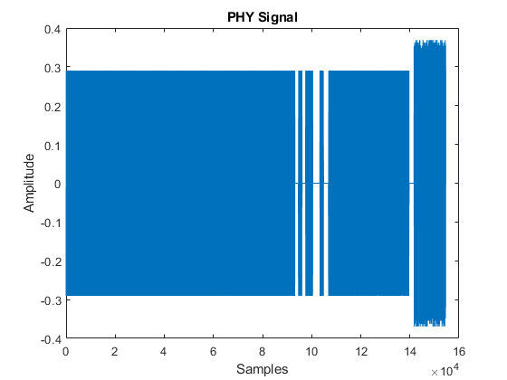</p>

- Based on your data and your config it will calculates for each blincks, iniators and receptors pairs : **the distance**, **the time of flight** and mostly **the Time Difference On Arrival (TDOA)**. It takes in account the noise and preamble (but you need to configure it).

```
     actualDistances = 3×1    
        13.4536
        35.1141
        45.2217
```

- After that, you will be able to see the TDOA based on hyperbolics intersection of pairs of nodes **for each initiators (devices)**. It takes 3 pairs of nodes (receptors) based on 3 nodes that you can choose and modify
<p align="center">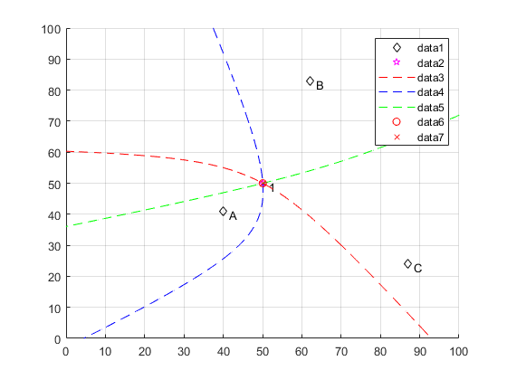
<p align="center">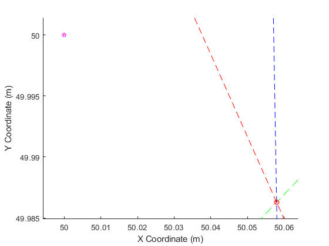
<p align="center">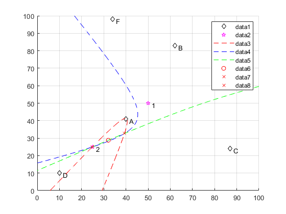
<p align="center">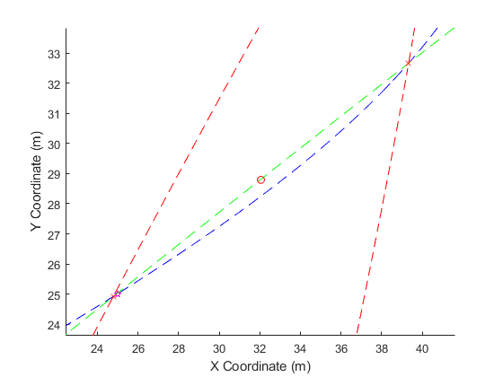
     
- Finaly, the program will caculates **the distance errors** difference between the device position and the hyperbolics intersection because as you see the intersection doesn't cross the initiator.

```
     Localization error for device 1:
     Localization error #1 = 0.060 m.
```

# 2. Post Processing with real CIR values
The goal here is to be able to analyse the channel impulsive response. As there are several ways of processing the data, several more or less complex versions, there are several versions of the programme (5 versions : *[Description](processingCirDataFromMeasurmentsVersions.md)*).

However, they all have a common structure, which I will describe in detail below. 

<p align="center">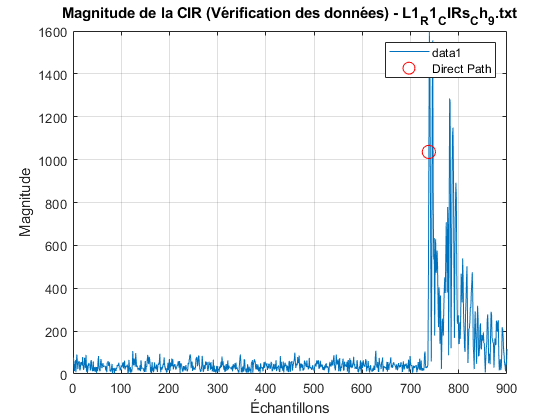</p><h3 align="center">Channel Impulsive Response 900 samples in LOS</h3>
<p align="center">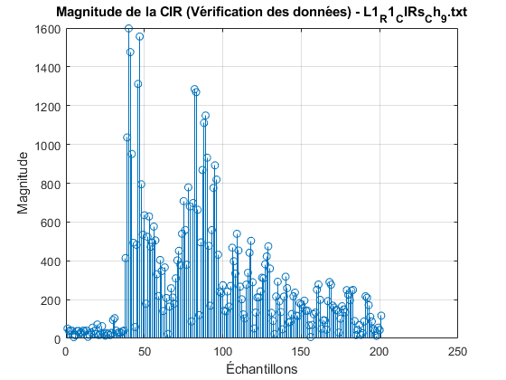</p><h3 align="center">Channel Impulsive Response zoom in the last approx. 250 samples in LOS</h3>

# 3. Theoretical UWB Channel and CIR
Ce code est basé sur l'exemple de la toolbox : uwb Channel Models (*[matlab link](https://it.mathworks.com/help/comm/ug/uwb-channel-model.html)*)
Voici une explication détaillée de l'exemple : *[uwb-Channel-Models.md link](uwb-Channel-Models.md)*
Dans un premier temps, vous devez parametrer votre channel ( dans mon cas, celle de la carte DWM3001CDK) et ces couches Mac et Physique. Pour y parvenir, j'ai du utilisé le sofware et le forum pour certaines informations précise comme la transmition power. Je vous conseille très fortement de vous rendre sur le forum : ***https://forum.qorvo.com/c/wireless-connectivity/ultra-wideband/5***

### UWB Channel Config

```
  Type              - Environment type ( 'Indoor office', 'Industrial')
  HasLOS            - Boolean indicating presence of line-of-sight component
  ChannelNumber     - UWB channel number (0, 1, 2, ... 15)
  TransmitPower     - Transmit power, in Watts
  Distance          - Distance between transmitter and receiver in meters
  MaxDopplerShift   - Maximum Doppler shift (Hz)
  LastPathThreshold - Minimum power of last path, relative to first path
  SampleRate        - Input signal sample rate (Hz)
  SampleDensity     - Number of time samples per half wavelength 
  ChannelFiltering  - Perform channel filtering (logical)

```


### Results
La  toolbox utilise l'affichage de l'oscilloscope pour afficher les CIRs.

<p align="center">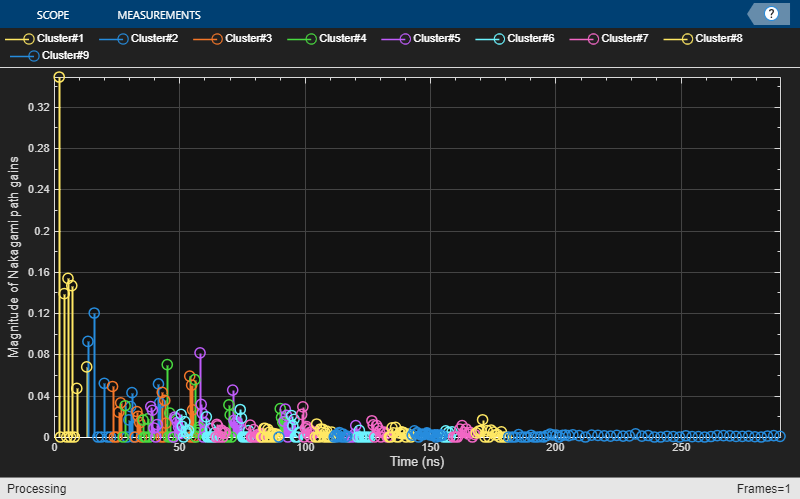<h3 align="center">LOS</h3>
<p align="center">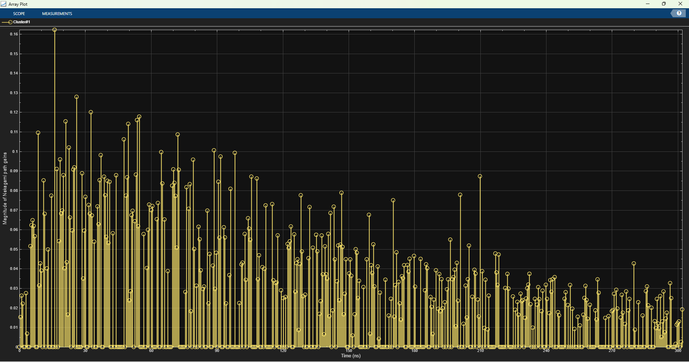<h3 align="center">NLOS</h3>

Pour vérifier les CIRs, j'ai cherché la variable stockant les magnitudes des samples (pour chaque cluster). Cela m'a permis d'obtenir ces graphes et de configurer le dataset.
     
<p align="center">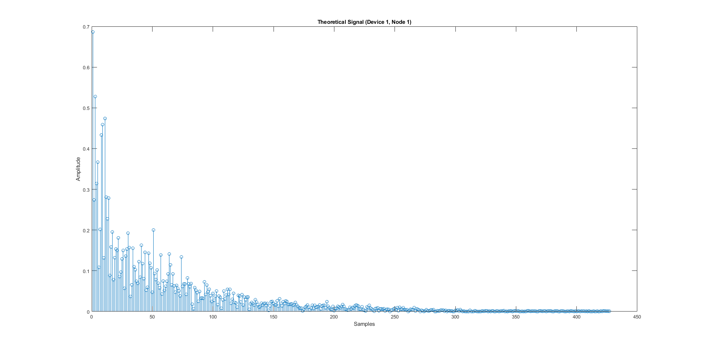<h3 align="center">LOS</h3>
<p align="center">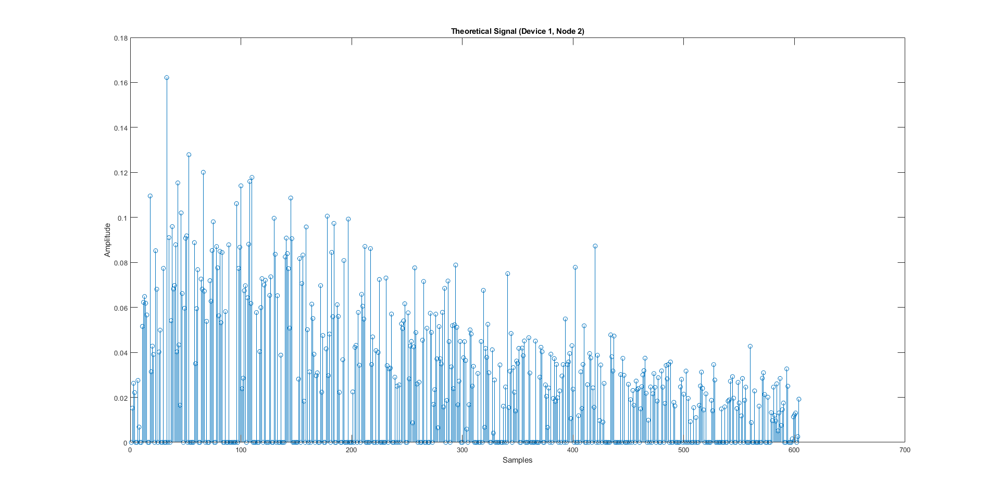<h3 align="center">NLOS</h3>

J'aimerai revenir sur la détermination de certains paramètres qui sont, a mon avis, pas correct mais pas dénuer de sens.

1. Transmition power : pas beaucoup d'info, vraiment pas la seule que j'ai trouvé est celle-ci : ***https://forum.qorvo.com/t/dwm3001cdk-transmission-range/15141***. En ce basant sur la puissance RMS de -41,3 dBm/MHz
et en faisant ce petit calcul je trouve : $10^\frac{-41.3}{10} *10^-3 = 74.131 nW/MHz$
2. LastPathThreshold : AUCUNE INFO mise à part que cela represente le "Minimum power of last path, relative to first path"
3. SampleDensity :
4. MaxDopplerShift :
5. ChannelFiltering : 


Il ne vous restera plus qu'à selectionner le nombre d'itérations pour générer une multitude de CIR et creer votre dataset.


# 4. Dataset creation
La creation du dataset est basé sur l'index des samples et la magnitude associée. Le code créé un fichier csv contenant : l'index des anchors et tags, le cas LOS ou NLOS (1 ou 0) et la magnitude des samples.
<p align="center">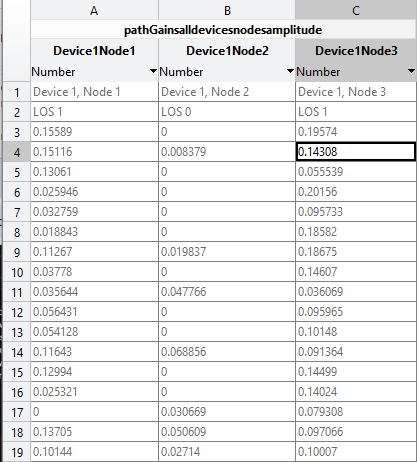

# 5. References
## Papers
Some papers interesting and not it depends on what you search.
- [Detection of the LOS/NLOS state change based on the CIR features](doc/Detection_of_the_LOS_NLOS_state_change_based_on_the_CIR_features.pdf)
- [NOISE: Radio Channel Impulse Response Measurement and Analysis](doc/Radio_Channel_Impulse_Response_Measurement_and_Analysis.pdf)
- [Impulsive noise in UWB systems and its suppression](doc/Impulsive_noise_in_UWB_systems_and_its_suppression)
- [UWB Channel Impulse Responses for Positioning in complex environments](doc/UWB_Channel_Impulse_Responses_for_Positioning_in_complex_environments)
## DWM1000
- [Application Note APS006 Part 1](doc/Application_Note_APS006_Part_1.pdf)
- [Application Note APS006 Part 2](doc/Application_Note_APS006_Part_2.pdf)
- [Application Note APS006 Part 3](doc/Application_Note_APS006_Part_3.pdf)
- [DWM1001-DEV_Datasheet]()
## DWM3000
- [DWM3000 Data Sheet](doc/DWM3000_Data_Sheet.pdf)
- [DWM3001CDK_SDK_Developer_Guide_0.1.1](doc/DWM3001CDK_SDK_Developer_Guide_0.1.1.pdf)
- [DWM3001CDK_SDK_Release_Notes_0.1.1](doc/DWM3001CDK_SDK_Release_Notes_0.1.1.pdf)
- [Qovro_7_7_2022_DWM3001CDK_Quick_Start_Guide-2998998](doc/Qovro_7_7_2022_DWM3001CDK_Quick_Start_Guide-2998998.pdf)
- [UWB-Stack-R11.9.2](doc/UWB-Stack-R11.9.2.pdf)
- [Indoor UWB Positioning and Position Tracking Data Set](doc/Indoor_UWB_Positioning_and_Position_Tracking_Data_Set.pdf)

## For Matlab :
### Description :
[Ultra-Wideband (UWB)](https://fr.mathworks.com/discovery/ultra-wideband.html)
### All progs gives by the toolbox
[UWB](https://fr.mathworks.com/help/comm/uwb.html?s_tid=CRUX_lftnav)
- [uwbChannel](https://fr.mathworks.com/help/comm/ref/uwbchannel-system-object.html)
- [UWB Localization Using IEEE 802.15.4z](https://fr.mathworks.com/help/comm/ug/uwb-localization-using-ieee-802.15.4z.html)
- [UWB Ranging Using IEEE 802.15.4z](https://fr.mathworks.com/help/comm/ug/uwb-ranging-using-ieee-802.15.4z.html)

