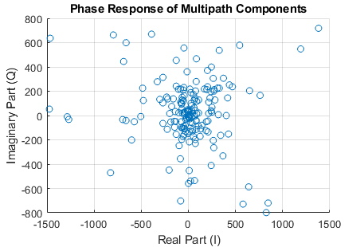

# UWB-Algorithms-on-MATLAB

## Table of Contents
1. [UWB 802.15.4 toolbox Matlab](#1-uwb-localization-using-ieee-802154z)
     - [One Way Ranging / Time Difference On Arrival](#one-way-ranging--time-difference-on-arrival)
2. [Post Processing with real CIR values](#2-post-processing-with-real-cir-values)
     - [Channel Impulsive Response (CIR)](#phase-response-of-multipath-components)
     - [Phase response of multipath Components](#phase-response-of-multipath-components)
3. [Theoretical UWB Channel and CIR](#3-theoretical-uwb-channel-and-cir)
     - [UWB Channel Config](#UWB-Channel-Config)
     - [Results](#results)
          - [Comparison of the phase responses on a complex plan in LOS and NLOS](#Comparison-of-the-phase-responses-in-LOS-and-NLOS)
     - [Questions](#questions-or-problems-or-optimisations)
4. [Data set Creation](#4-dataset-creation)
5. [References](#5-References)

# 1. UWB Localization Using IEEE 802.15.4z
### One Way Ranging / Time Difference On Arrival
This first part is based on the *[UWB Localization Using IEEE 802.15.4z](https://fr.mathworks.com/help/comm/ug/uwb-localization-using-ieee-802.15.4z.html)* program gives by matlab.
- Firstly, you put in input **an infinte number of anchors and tags**. It will calculates the distance and the time of flight between the initiators and the receptors based on the coordonates.
<p align="center"></p>

- Then you will put your data file for configure the MAC and PHY layers
```
     MACFrameConfig properties:
  
     FrameType                    - The type of the MAC frame
     SequenceNumber               - The frame sequence number
     AcknowledgmentRequest        - Option to request acknowledgment
     DestinationAddressing        - Destination addressing mode
     DestinationPANIdentifier     - PAN identifier of destination
     DestinationAddress           - Destination address
     SourceAddressing             - Source addressing mode
     SourcePANIdentifier          - PAN identifier of source
     SourceAddress                - Source address
     PANIdentificationCompression - Option to skip source PAN ID from addressing fields
     FramePending                 - Indication that more frames are imminent
     FrameVersion                 - Standard compliant frame version
     BeaconOrder                  - Duration of beacon interval
     SuperframeOrder              - Length of active superframe portion
     FinalCAPSlot                 - The last superframe slot of the Contention Access Period
     BatteryLifeExtension         - Battery life extension
     PANCoordinator               - Flag indicating beacon transmission by PAN coordinator
     PermitAssociation            - Flag indicating permissible associations
     PermitGTS                    - Flag indicating permissible guaranteed time slots (GTS)
     GTSList                      - Cell array describing guaranteed time slots
     PendingAddresses             - List of pending short and extended addresses.
     FFDDevice                    - Flag indicating full function device 
     BatteryPowered               - Flag indicating lack of power connection
     IdleReceiving                - Flag indicating receptions during idle periods 
     AllocateAddress              - Flag indicating address allocation during association 
     ShortAddress                 - Short addressed assigned during association
     AssociationStatus            - AssociationStatus
     DisassociationReason         - Reason for disassociation
     GTSCharacteristics           - Detailed GTS request
```

```
  Physical  lrwpanHRPConfig properties:

   Channel                 - Channel number
   Mode                    - Operation mode
   MeanPRF                 - Mean pulse repetition frequency (in MHz)
   DataRate                - Payload data rate (in Mbps)
   PHRDataRate             - PHR data rate (in Mbps)
   SamplesPerPulse         - Number of samples per Butterworth pulse
   STSPacketConfiguration  - Control STS placement within the packet
   NumSTSSegments          - Number of STS segments
   STSSegmentLength        - Length of active STS segments as a multiple of 512 chips
   ExtraSTSGapLength       - Length of extra STS gap, as a multiple of 4 chips
   ExtraSTSGapIndex        - Index of extra STS gap value
   CodeIndex               - Index of used SYNC code from Tables 15-6, 15-7 and 15-7a
   PreambleMeanPRF         - Mean PRF (pulse repetition frequency) of the preamble (in MHz)
   PreambleDuration        - Number of repetitions of spread preamble SYNC codes
   SFDNumber               - Index of Start-of-Frame Delimiter choice
   Ranging                 - Flag denoting if the PHY frame is for ranging
   ConstraintLength        - Flag denoting the constraint length of convolutional coding
   PSDULength              - Length of PHY service data unit (in bytes)
   SampleRate              - Sample rate of waveform
```

<p align="center"></p>

- Based on your data and your config it will calculates for each blincks, iniators and receptors pairs : **the distance**, **the time of flight** and mostly **the Time Difference On Arrival (TDOA)**. It takes in account the noise and preamble (but you need to configure it).

```
     actualDistances = 3×1    
        13.4536
        35.1141
        45.2217
```
⚠️Les resultats ci-dessus ne correspondent pas avec les photos. Dans ce cas, vous aurez une matrice 3x6.

- After that, you will be able to see the TDOA based on hyperbolics intersection of pairs of nodes **for each initiators (devices)**. It takes 3 pairs of nodes (receptors) based on 3 nodes that you can choose and modify
<p align="center">
<p align="center">
<p align="center">
<p align="center">
     
- Finaly, the program will caculates **the distance errors** difference between the device position and the hyperbolics intersection because as you see the intersection doesn't cross the initiator.

```
     Localization error for device 1:
     Localization error #1 = 0.060 m.
     Localization error for device 2:
     Localization error #1 = 0.034 m.
```

# 2. Post Processing with real CIR values
## Channel Impulse response 
The goal here is to be able to analyse the channel impulsive response. As there are several ways of processing the data, several more or less complex versions, there are several versions of the programme (5 versions : *[Description](processingCirDataFromMeasurmentsVersions.md)*).

However, they all have a common structure, which I will describe in detail below. 

<p align="center"></p><h3 align="center">Channel Impulsive Response 900 samples in LOS</h3>
<p align="center"></p><h3 align="center">Channel Impulsive Response zoom in the last approx. 250 samples in LOS</h3>

## Phase response of multipath components
<p align="center"></p>

**Composante réelle (In-phase, I) :** représente la partie réelle du gain complexe d'un chemin multipath. En termes simples, c'est la partie du signal qui est en phase avec le signal d'origine.

**Composante imaginaire (Quadrature, Q) :** représente la partie imaginaire du gain complexe d'un chemin multipath.

La dispersion des points sur le graphique montre la distribution des gains multipath complexes. Une forte concentration autour de l'origine (0,0) indique que la plupart des chemins multipath ont des gains relativement faibles.

#### Amplitude et Phase :
La distance d'un point par rapport à l'origine indique l'amplitude du gain multipath.
L'angle d'un point par rapport à l'axe réel (horizontal) indique la phase du chemin multipath.

La connaissance précise des valeurs I et Q pour chaque chemin permet de mieux comprendre et modéliser les effets de propagation, ce qui est crucial pour le traitement du signal, l'estimation du canal, et les techniques de démodulation en communication UWB.

# 3. Theoretical UWB Channel and CIR
Ce code est basé sur l'exemple de la toolbox : uwb Channel Models (*[matlab link](https://it.mathworks.com/help/comm/ug/uwb-channel-model.html)*)
Voici une explication détaillée de l'exemple : *[uwb-Channel-Models.md link](uwb-Channel-Models.md)*
Dans un premier temps, vous devez parametrer votre channel ( dans mon cas, celle de la carte DWM3001CDK) et ces couches Mac et Physique. Pour y parvenir, j'ai du utilisé le sofware et le forum pour certaines informations précise comme la transmition power. 

Je vous conseille très fortement de vous rendre sur le forum : ***https://forum.qorvo.com/c/wireless-connectivity/ultra-wideband/5***
## UWB Channel Config
### UWB Channel

```
  Type              - Environment type ( 'Indoor office', 'Industrial')
  HasLOS            - Boolean indicating presence of line-of-sight component
  ChannelNumber     - UWB channel number (9 or 5)
  TransmitPower     - Transmit power, in Watts
  Distance          - Distance between transmitter and receiver in meters
  MaxDopplerShift   - Maximum Doppler shift (Hz)
  LastPathThreshold - Minimum power of last path, relative to first path
  SampleRate        - Input signal sample rate (Hz)
  SampleDensity     - Number of time samples per half wavelength 
  ChannelFiltering  - Perform channel filtering (logical)
```
### UWB Environments
function : uwbChannelConfig
```
   uwbChannelConfig properties:

   Type                        - Environment type ('Indoor office','Industrial')
   HasLOS                      - Boolean indicating presence of line-of-sight component
   ReferencePathLoss           - Path loss (in dB) at 1 m distance
   PathLossExponent            - Path loss exponent
   ShadowingDeviation          - Standard deviation of shadowing
   AntennaLoss                 - Antenna loss
   FrequencyExponent           - Frequency dependence of path loss
   AverageNumClusters          - Mean number of clusters
   ClusterArrivalRate          - Inter-cluster arrival rate
   PathArrivalRate1            - First (ray) arrival rate for mixed Poisson model
   PathArrivalRate2            - Second (ray) arrival rate for mixed Poisson model
   MixtureProbability          - Mixture probability for mixed Poisson model
   ClusterEnergyDecayConstant  - Inter-cluster exponential decay constant
   PathDecaySlope              - Slope of intra-cluster exponential decay constant
   PathDecayOffset             - Offset of intra-cluster exponential decay constant
   ClusterShadowingDeviation   - Standard deviation of cluster shadowing
   PDPIncreaseFactor           - Increase rate of alternative power delay profile
   PDPDecayFactor              - Decay rate of alternative power delay profile (at later times)
   FirstPathAttenuation        - Attenuation of 1st component in alternative power delay profile
   NakagamiMeanOffset          - Offset of Nakagami m factor mean
   NakagamiMeanSlope           - Slope of Nakagami m factor mean
   NakagamiDeviationOffset     - Offset of Nakagami m factor variance
   NakagamiDeviationSlope      - Slope of Nakagami m factor variance
   FirstPathNakagami           - Nakagami m factor of first (strong) component
```
```
Exemple d'environment : 
  function obj = setupIndoorOfficeEnvironment(obj)
      if obj.HasLOS
        obj.ReferencePathLoss           = 35.4;
        obj.PathLossExponent            = 1.63;
        obj.ShadowingDeviation          = 1.9;
        obj.AntennaLoss                 = 3;
        obj.FrequencyExponent           = 0.03;
        obj.AverageNumClusters          = 5.4;
        obj.ClusterArrivalRate          = 0.016;
        obj.PathArrivalRate1            = 0.19;
        obj.PathArrivalRate2            = 2.97;
        obj.MixtureProbability          = 0.0184;
        obj.ClusterEnergyDecayConstant  = 14.6;
        obj.PathDecaySlope              = 0;
        obj.PathDecayOffset             = 6.4;
        obj.ClusterShadowingDeviation   = nan;
        obj.PDPIncreaseFactor           = nan;
        obj.PDPDecayFactor              = nan;
        obj.FirstPathAttenuation        = nan;
        obj.NakagamiMeanOffset          = 0.42;
        obj.NakagamiMeanSlope           = 0;
        obj.NakagamiDeviationOffset     = 0.31;
        obj.NakagamiDeviationSlope      = 0;
        obj.FirstPathNakagami           = nan;
      else % NLOS
        obj.ReferencePathLoss           = 57.9;
        obj.PathLossExponent            = 3.07;
        obj.ShadowingDeviation          = 3.9;
        obj.AntennaLoss                 = 3;
        obj.FrequencyExponent           = 0.71;
        obj.AverageNumClusters          = 1;
        obj.ClusterArrivalRate          = nan;
        obj.PathArrivalRate1            = nan;
        obj.PathArrivalRate2            = nan;
        obj.MixtureProbability          = nan;
        obj.ClusterEnergyDecayConstant  = nan;
        obj.PathDecaySlope              = nan;
        obj.PathDecayOffset             = nan;
        obj.ClusterShadowingDeviation   = nan;
        obj.PDPIncreaseFactor           = 15.21;
        obj.PDPDecayFactor              = 11.84;
        obj.FirstPathAttenuation        = 0.86;
        obj.NakagamiMeanOffset          = 0.5;
        obj.NakagamiMeanSlope           = 0;
        obj.NakagamiDeviationOffset     = 0.25;
        obj.NakagamiDeviationSlope      = 0;
        obj.FirstPathNakagami           = nan;
      end
    end
```
### Results
La  toolbox utilise l'affichage de l'oscilloscope pour afficher les CIRs.

<p align="center"><h3 align="center">LOS</h3>
<p align="center"><h3 align="center">NLOS</h3>

Pour vérifier les CIRs, j'ai cherché la variable stockant les magnitudes des samples (pour chaque cluster). Cela m'a permis d'obtenir ces graphes et de configurer le dataset.
     
<p align="center"><h3 align="center">LOS</h3>
<p align="center"><h3 align="center">NLOS</h3>
     
### Comparison of the phase responses in LOS and NLOS

### Questions or Problems or Optimisations
J'aimerai revenir sur la détermination de certains paramètres qui sont, a mon avis, pas correct mais pas dénuer de sens.

1. Transmition power : pas beaucoup d'info, vraiment pas,  la seule que j'ai trouvé est celle-ci : ***https://forum.qorvo.com/t/dwm3001cdk-transmission-range/15141***.
  
     En ce basant sur la puissance RMS de -41,3 dBm/MHz et en faisant ce petit calcul je trouve :      $10^\frac{-41.3}{10} *10^-3 = 74.131 nW/MHz$.

     Puis, nous multiplions la puissance par la fréquence du channel (pour chaque channel); dans le code **FC** (variable stockant la fréquence du channel). 

2. LastPathThreshold : AUCUNE INFO mise à part que cela represente le "Minimum power of last path, relative to first path"
3. SampleDensity :
4. MaxDopplerShift :
5. ChannelFiltering : 


Il ne vous restera plus qu'à selectionner le nombre d'itérations pour générer une multitude de CIR et creer votre dataset.


# 4. Dataset creation
La creation du dataset est basé sur l'index des samples et la magnitude associée. Le code créé un fichier csv contenant : l'index des anchors et tags, le cas LOS ou NLOS (1 ou 0) et la magnitude des samples (dans cet ordre).
<p align="center">

# 5. References
## Papers
Some papers interesting and not it depends on what you search.
- [Detection of the LOS/NLOS state change based on the CIR features](doc/Detection_of_the_LOS_NLOS_state_change_based_on_the_CIR_features.pdf)
- [NOISE: Radio Channel Impulse Response Measurement and Analysis](doc/Radio_Channel_Impulse_Response_Measurement_and_Analysis.pdf)
- [Impulsive noise in UWB systems and its suppression](doc/Impulsive_noise_in_UWB_systems_and_its_suppression)
- [UWB Channel Impulse Responses for Positioning in complex environments](doc/UWB_Channel_Impulse_Responses_for_Positioning_in_complex_environments)
## DWM1000
- [Application Note APS006 Part 1](doc/Application_Note_APS006_Part_1.pdf)
- [Application Note APS006 Part 2](doc/Application_Note_APS006_Part_2.pdf)
- [Application Note APS006 Part 3](doc/Application_Note_APS006_Part_3.pdf)
- [DWM1001-DEV_Datasheet]()
## DWM3000
- [DWM3000 Data Sheet](doc/DWM3000_Data_Sheet.pdf)
- [DWM3001CDK_SDK_Developer_Guide_0.1.1](doc/DWM3001CDK_SDK_Developer_Guide_0.1.1.pdf)
- [DWM3001CDK_SDK_Release_Notes_0.1.1](doc/DWM3001CDK_SDK_Release_Notes_0.1.1.pdf)
- [Qovro_7_7_2022_DWM3001CDK_Quick_Start_Guide-2998998](doc/Qovro_7_7_2022_DWM3001CDK_Quick_Start_Guide-2998998.pdf)
- [UWB-Stack-R11.9.2](doc/UWB-Stack-R11.9.2.pdf)
- [Indoor UWB Positioning and Position Tracking Data Set](doc/Indoor_UWB_Positioning_and_Position_Tracking_Data_Set.pdf)

## For Matlab :
### Description :
[Ultra-Wideband (UWB)](https://fr.mathworks.com/discovery/ultra-wideband.html)
### All progs gives by the toolbox
[UWB](https://fr.mathworks.com/help/comm/uwb.html?s_tid=CRUX_lftnav)
- [uwbChannel](https://fr.mathworks.com/help/comm/ref/uwbchannel-system-object.html)
- [UWB Localization Using IEEE 802.15.4z](https://fr.mathworks.com/help/comm/ug/uwb-localization-using-ieee-802.15.4z.html)
- [UWB Ranging Using IEEE 802.15.4z](https://fr.mathworks.com/help/comm/ug/uwb-ranging-using-ieee-802.15.4z.html)

## Qorvo forum
